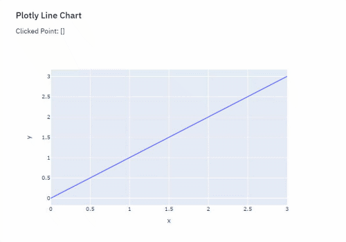

# Streamlit Plotly MapBox Events





## First things first

This Repository is heavily inspired my [Null Jones - Plotly Events](https://github.com/null-jones/streamlit-plotly-events)

Since it didn't cover scattermaps in a way I need. I decided to reuse her repository and fit it to the needs of a scattermap

### Installation

Install via Pip!

```pip install streamlit-plotly-mapboxEvents```

### Usage

Import the component, and use it like any other Streamlit custom component!
```python
import streamlit as st
import plotly.express as px
import pandas as pd
from streamlit_plotly_mapbox_events import plotly_mapbox_events

st.set_page_config(layout="wide")

df = pd.DataFrame({'lat': {0: 49.058, 1: 50.383, 2: 49.599000000000004, 3: 50.677, 4: 53.036, 5: 50.541, 6: 51.524,
                           7: 54.992, 8: 49.88},
                   'lon': {0: 11.115, 1: 12.528, 2: 11.231, 3: 10.408, 4: 8.185, 5: 8.055, 6: 7.638999999999999,
                           7: 11.636, 8: 7.678}, 'hover': {0: 1, 1: 2, 2: 3, 3: 4, 4: 5, 5: 6, 6: 7, 7: 8, 8: 9},
                   'color_1': {0: 3, 1: 3, 2: 4, 3: 3, 4: 5, 5: 5, 6: 5, 7: 4, 8: 2},
                   'color_2': {0: 5, 1: 5, 2: 3, 3: 1, 4: 1, 5: 2, 6: 5, 7: 2, 8: 2}, 'color_3':
                       {0: 3, 1: 2, 2: 1, 3: 5, 4: 3, 5: 2, 6: 5, 7: 2, 8: 2}})

column_selected = st.selectbox(label="columns", options=df.columns[3:])

mapbox = px.scatter_mapbox(df, lat="lat", lon="lon", hover_name="hover", color=column_selected,
                           zoom=5.5, height=500)

mapbox.update_layout(mapbox_style="carto-positron")
mapbox.update_layout(margin={"r": 0, "t": 0, "l": 0, "b": 0})
plot_name_holder_clicked = st.empty()
plot_name_holder_selected = st.empty()
plot_name_holder_hovered = st.empty()
plot_name_holder_relayout = st.empty()
mapbox_events = plotly_mapbox_events(
    mapbox,
    click_event=True,
    select_event=True,
    hover_event=True,
    relayout_event=True)

plot_name_holder_clicked.write(f"Clicked Point: {mapbox_events[0]}")
plot_name_holder_selected.write(f"Selected Point: {mapbox_events[1]}")
plot_name_holder_hovered.write(f"Hovered Point: {mapbox_events[2]}")
plot_name_holder_relayout.write(f"Relayout: {mapbox_events[3]}")
```

What the component returns:
```
    tuple consisting of list or dictionary

        events will be returned ordered
            1. Click Event
            2. Select Event
            3. Hover Event
            4. Relayout Event

        For selected, click and hoverevents:
        List of dictionaries containing marker details (in case multiple overlapping
        marker have been clicked/selected/hovereed).

        Details can be found here:
            https://plotly.com/javascript/plotlyjs-events/#event-data

        Format of dict:
            {
                lat: int (lat value of point),
                lon: int (lon value of point),
                pointNumber: (index of selected point),
                pointIndex: (index of selected point)
            }

        For relayout event
        Only a dictionary will be returned

        Format of dict:
            {
                raw: containing the raw information about the relayout event
                lat: new lat position
                lon: new lon position
                zoom: new zoom level
            }
```

## Events
Currently, a number of plotly events can be enabled.  They can be enabled/disabled using kwargs on the `plotly_event()` function.
- **Click** `click_event` (defaults to `True`): Triggers event on mouse click of marker
- **Select** `select_event`: Triggers event when markers have been selected
- **Hover** `hover_event`: Triggers event on mouse hover of marker
- **Relayout** `relayout_event`: Triggers if the layout has changed. Occurs on Zoom and Moving

